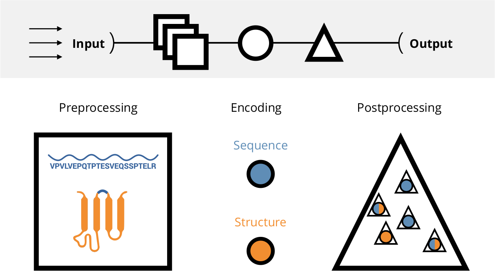

A tool for an <b>in-depth comparison</b> and <b>benchmarking</b> of <b>peptide encodings</b>. 
All computations are <b>highly parallelized</b> and work efficiently across <b>multiple datasets and 
encodings</b>. For a thorough introduction refer to <a href='https://scholar.google.de/citations?user=lEVtMBMAAAAJ&hl=en' style='{link_style}'>Spänig <i> et al.</i> (2020)</a>.

The visualizations can be interactively accessed at [https://peptidereactor.mathematik.uni-marburg.de/](https://peptidereactor.mathematik.uni-marburg.de/).

#### Overview



The emphasis is put on high-throughput processing of an arbitrary amount of input datasets (arrows), followed by the 
preprocessing, encoding, and postprocessing, generating the final output (top). The preprocessing includes sanitizing 
of the input sequences and the tertiary structure approximation, among others. Afterwards, the sequences as well as the 
accompanied structures are used for the encoding. The postprocessing involves machine learning and the visual 
preparation of the analyses, among others.

#### Installation

1. Clone this repo:  
    `git clone git@github.com:spaenigs/peptidereactor.git`.
    
2. `cd` into the root directory (`peptidereactor/`)

3. Install [conda](https://docs.conda.io/projects/conda/en/latest/user-guide/install/linux.html):  
   `peptidereactor/conda/install.sh`. 

4. Create the conda environment:   
   `peptidereactor/conda/create_env.sh`
   
5. Install docker:
    - Ubuntu: `./peptidereactor/install_docker_io`
    - Other distros: `./peptidereactor/install_docker_ce` 
    
6. Build images:   
   - `./peptidereactor/docker/build_image`
   - `./peptidereactor-vis/docker/build_image`
  
#### Execution
   
1. Jobs to be executed:  
   - `./main.py --quiet --dag | dot -Tsvg > dag.svg` (DAG) 
   - `./main.py --quiet -nr` (list)

2. Run the pipeline:  
   `./main.py --quiet`
   
3. Results:  
   - Run server `./peptidereactor-vis/run_server` and
   - access http://localhost:8501

#### Custom nodes

The implementation of the PEPTIDE REACToR follows a modular design, such that meta
nodes can be connected almost arbitrarily. Moreover, custom nodes can be easily added.
__Note that this tool is based on [Snakemake](https://snakemake.readthedocs.io/en/stable/),
hence all conditions for a valid Snakemake-workflow must be also fulfilled.__

##### Example

A node to conduct multiple sequence alignment. Since we might need such a general node 
multiple times, we add it to the `utils` category.

1) `mkdir nodes/utils/multiple_sequence_alignment`
2) `touch nodes/utils/multiple_sequence_alignment/Snakefile`
3) Specify input and output via config dictionary, e.g., `config["fastas_in"]` 
   and `config["fastas_out"]`.
4) Copy/paste into the `Snakefile` and adapt stub:

    ```snakemake
    # from ... import ...
    
    TOKEN = config["token"]  # access unique token
    
    rule all:
        input:
             config["fastas_out"]
    
    rule multiple_sequence_alignment:
        input:
             config["fastas_in"]
        output:
             config["fastas_out"]
        run:
             pass
    ```

5) `touch nodes/utils/multiple_sequence_alignment/__init__.py` for the API and 
   copy/paste the following:
   
   ```python
    import secrets
    
    # rule name
    def _get_header(token):
        return f'''
    rule utils_multiple_sequence_alignment_{token}:'''
    
    ... 
   
    # specify input, output and path to the Snake- and configuration file.
    def _get_main(fastas_in, fastas_out):
        return f'''
        input:
             fastas_in={fastas_in}
        output:
             fastas_out={fastas_out}
        ...
    '''
    
    # specify input and output
    def rule(fastas_in, fastas_out, benchmark_dir=None):
        token = secrets.token_hex(4)
        rule = _get_header(token)
        if benchmark_dir is not None:
            benchmark_out = f"{benchmark_dir}utils_multiple_sequence_alignment_{token}.txt"
        ...
   ``` 
   Refer to an actual `__init__.py` for a complete example.   
6) Make the node visible by adding `from . import multiple_sequence_alignment` in 
   `nodes/utils/__init__.py`. 
7) Import and use the node in `main.py`:
   ```python
   import nodes.utils as utils
   
   w.add(utils.multiple_sequence_alignment.rule(
         fastas_in=["data/{dataset}/seqs_mapped.fasta", "data/{dataset}/seqs_sec.fasta",
                    "data/{dataset}/seqs_ter.fasta"],
         fastas_out=["data/{dataset}/seqs_msa.fasta", "data/{dataset}/seqs_msa_sec.fasta",
                     "data/{dataset}/seqs_msa_ter.fasta"],
         benchmark_dir=w.benchmark_dir))
   ```
8) During implementation, it might be helpful to run the rule isolated:
   ```shell script
   ./peptidereactor/run_pipeline -s nodes/utils/multiple_sequence_alignment/Snakefile \
                                 --config fasta_in=... fasta_out=... token=... \
                                 -nr
   ``` 
   or even access the Docker container interactively:
   ```shell script
   docker run -it --entrypoint "/bin/bash" peptidereactor
   ```
   
__Note that__ the PEPTIDE REACToR is still under development, thus changes are likely. 
However, the fundamental structure, highlighted above, will remain.